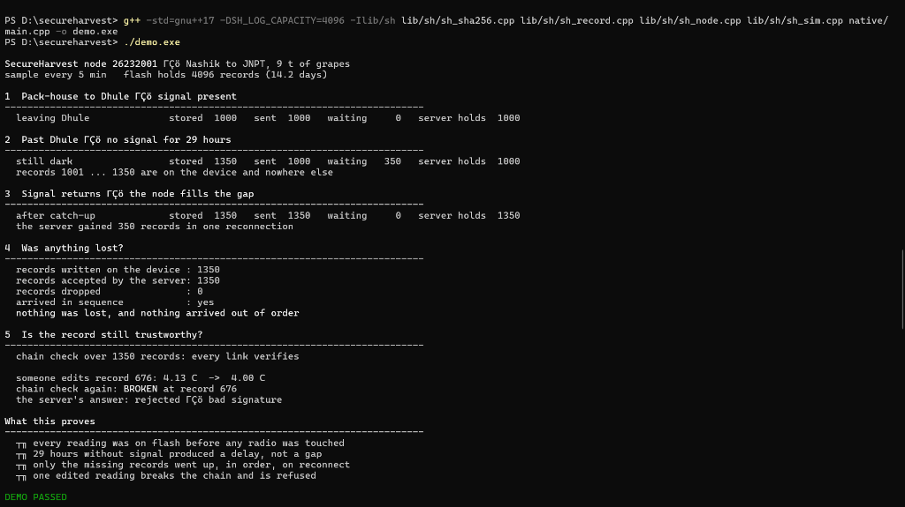
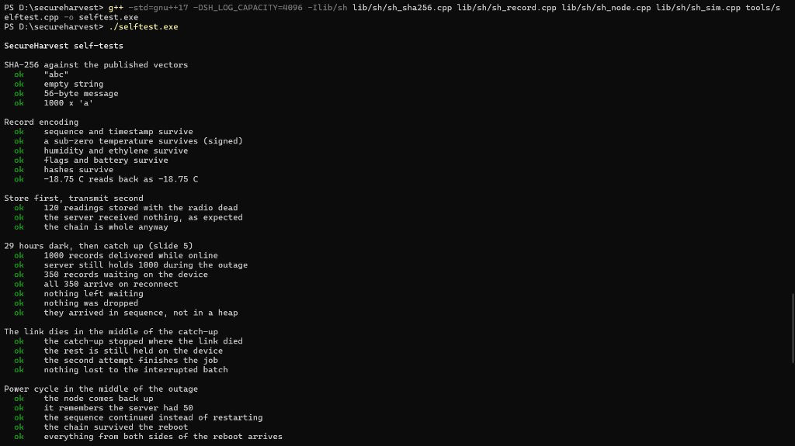
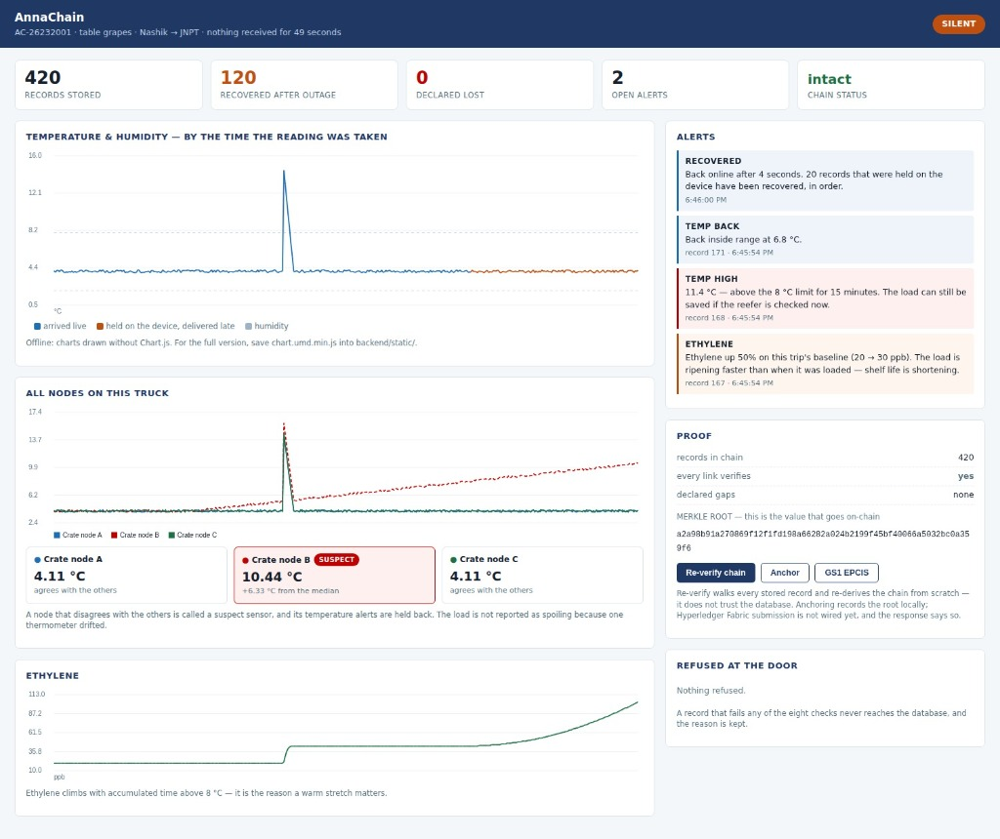
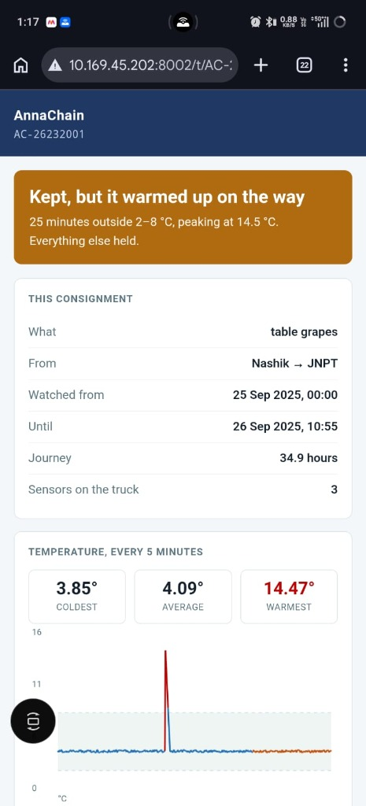
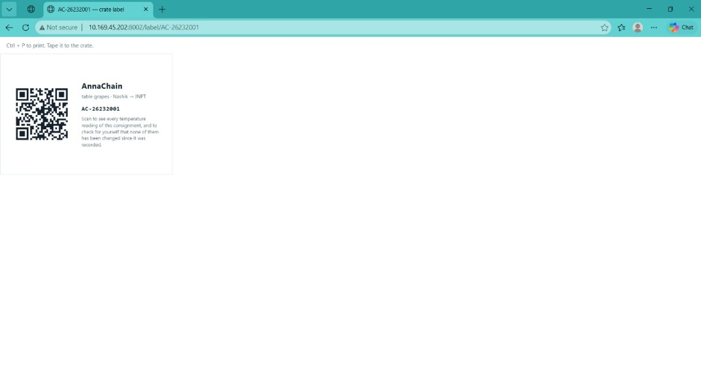

# AnnaChain — node firmware


[](https://github.com/shrutikbalwan/AnnaChain/actions/workflows/tests.yml)

The claim this project makes is one sentence long:

> A reading is signed and written to flash **before** any radio is touched, so a
> stretch of road with no signal produces a delay in the record, never a hole in it.

Everything in this repository exists to make that sentence demonstrable.

---

## Run it right now, with no hardware

You have not ordered parts yet. You do not need them to start.

```bash
g++ -std=gnu++17 -DAC_LOG_CAPACITY=4096 -DAC_NATIVE=1 -Ilib/ac lib/ac/*.cpp native/main.cpp -o demo
./demo
```

or, with PlatformIO installed:

```bash
pio run -e native -t exec
```

You will see the Nashik → JNPT run from slide 5 play out: 1000 records delivered,
29 hours with no signal, 350 records held on the device, all 350 recovered in
order on reconnect, the chain verified, and then one reading edited by hand so
you can watch the chain break at exactly that record.

**Run the tests too.** They are the deck's claims, written as assertions:

```bash
g++ -std=gnu++17 -DAC_LOG_CAPACITY=4096 -Ilib/ac lib/ac/*.cpp tools/selftest.cpp -o t && ./t
```

113 checks, including a power cut in the middle of the outage, a link that dies
mid-batch, a replayed record, an outage longer than the flash itself, gap notices
crossing the truck gateway, and the gateway being unable to forge a record.

---

## Screenshots — what it looks like running

**`./demo.exe` — the Nashik → JNPT run, end to end**



**`./selftest.exe` — 92 firmware checks, all green**



**Operations dashboard — three nodes, one suspect sensor, chain intact**



**Buyer trace page (mobile) — public, no login, re-verifiable**



**Printable crate label with QR code**



---

## The other half: the server and dashboard

`backend/` is everything that happens after a record leaves the node — the eight
checks, the database, alerts, chain verification, the Merkle root, GS1 EPCIS
output, and a dashboard that shows a truck going dark and coming back.

```powershell
py -m pip install fastapi uvicorn
py -m uvicorn backend.app:app --port 8000
py backend/feed_sim.py demo.capture --reset     # in a second terminal
```

See `backend/README.md`. It runs with no hardware either.

---

## What is here

```
lib/ac/
  ac_sha256.*    SHA-256 and HMAC. No dependencies.
  ac_record.*    One record: 84 bytes, fixed layout, explicit byte order.
  ac_hal.h       The four things the node needs: clock, sensors, flash, radio,
                 plus the signer. Interfaces only.
  ac_node.*      The node. tick() and resync() are the whole argument.
  ac_gateway.*   The truck gateway: collect, buffer, forward. It holds no
                 signing key, so it can delay data but never invent it.
  ac_sim.*       Laptop stand-ins: a plausible cold chain, a RAM flash, a
                 server that runs the eight checks, a LoRa link between nodes
                 and gateway, and an uplink you can switch off.
  ac_esp.*       The ESP32-S3 half: LittleFS ring, SHT40 driver, serial link.
src/main.cpp     Node firmware for the board.
src/gateway.cpp  Gateway firmware for the truck cab. The SX1262 driver is
                 stubbed and marked, because that part is not here yet.
native/main.cpp  The laptop demo.
tools/selftest.cpp  The tests.
tools/dump.cpp      Produces a capture file, so the server demo needs no board.
tools/fleet.cpp     Three nodes on one truck, one sensor drifting — the
                    cross-node self-diagnosis demo.
tools/server.py     A terminal-only server. Superseded by backend/ — kept
                    because it is 200 lines and readable in one sitting.
backend/            The real server: API, database, alerts, dashboard.
docs/BUY_LIST.md    What to order, and in what order.
docs/VERIFY.md      A hostile checklist for proving the project actually
                    works. Paste it into a fresh AI session, or work
                    through it by hand.
docs/DEMO.md        The 90 seconds you perform in front of a judge.
docs/HIL.md         Arrival day, steps 0-6: what to run when each part lands,
                    what it must print, and how it goes wrong.
docs/BRINGUP.md     The irreversible steps (ATECC608 locking, NVS erase), the
                    smoke-test format, the pin check, SX1262 troubleshooting.
```

The node logic never sees a `Serial`, a `LittleFS` or a `Wire`. That is why the
same `ac_node.cpp` runs on your laptop and on the board — and it is also why the
SX1262 can replace the USB cable later without touching a line of it.

---

## How a record is built

```
   sensors ──▶ Record{seq, ts, temp, rh, c2h4, flags, batt, prev}
                    │
                    ├─ prev  = SHA-256 of the record before it
                    ├─ digest = SHA-256 of all of the above
                    └─ sig    = sign(digest)          ← inside the device
                                     │
                              write to flash          ← before any radio
                                     │
                            is there a link?
                          ┌──────────┴──────────┐
                         no                    yes
                          │                     │
                  keep sampling          ask the server what it has,
                  keep storing           send only what is missing
                          └──────────┬──────────┘
                            8 checks, then stored
```

`prev` is what makes the chain: change one stored reading and every record after
it stops verifying. The server refuses the edited record on check 2 (signature)
and every later one on check 6 (chain). You can watch this happen in the demo.

---

## On the board

```bash
pio run -e node_mock -t upload    # fake sensor data — works with a bare dev board
pio run -e node      -t upload    # real SHT40 over I2C
python3 tools/server.py /dev/ttyACM0
```

For Evaluation 1 the "network" is the USB cable and `tools/server.py`. **The BOOT
button is the antenna.** Press it: the link drops and the node keeps logging.
Press it again: only the missing records go up. That is the demo, and it needs a
₹839 board and a ₹239 sensor.

When the SX1262 arrives, `SerialLink` is replaced by `LoraLink` and nothing above
it changes.

---

## What is honest about this code, and what is not yet

**Real:** the hash chain, the sequence reconciliation, the ring buffer and what
happens when it wraps, the eight checks, the flash layout that survives a power
cut, the behaviour under a link that dies mid-batch.

**Standing in, and marked as such in the source:**

- `SoftSigner` / `EspSoftSigner` use **HMAC-SHA256, not ECDSA**. The interface is
  the ATECC608B's; the hardware is not there yet. Because HMAC is symmetric, the
  laptop currently needs the node's key to check a signature — which is exactly
  the weakness the secure element removes. Say this out loud to a judge; it shows
  you know why the part is in the BOM.
- No ethylene sensor is read. The field is present and set to *not fitted*, which
  is the honest thing to transmit until the part is chosen.
- The node's clock starts at its build time and is set from the server's time,
  which comes with every last-ACK; records before that are flagged (docs/HIL.md step 1).
- `verifyChain` walks the whole ring. Fine at 4096 records; it wants a windowed
  version before a 90-day deployment.

**Not started:** the SX1262 LoRa driver itself (the gateway logic above it is
written and tested), NFC shipment assignment, Hyperledger Fabric
submission (the Merkle root is computed and stored; putting it on-chain is not
wired, and the API says so), the shelf-life model.

---

## Next

1. Order the two parts in `docs/BUY_LIST.md` — today, so they arrive this week.
2. Run the native demo and the tests. Read `ac_node.cpp`; it is 120 lines and it
   is the whole project.
3. When the board lands, flash `node_mock` and do the BOOT-button demo.
4. When the SHT40 lands, flash `node`, and put the sensor in a glass of iced
   water while it logs.
5. When the SX1262 modules land, fill in `LoraRadio` in `src/gateway.cpp` — it
   is the only part of the gateway that is missing, and the wiring and settings
   are written down there.
5. Photograph and screenshot all of it. **The deck still has no prototype
   evidence, and that is the one thing standing between it and a winning one.**
